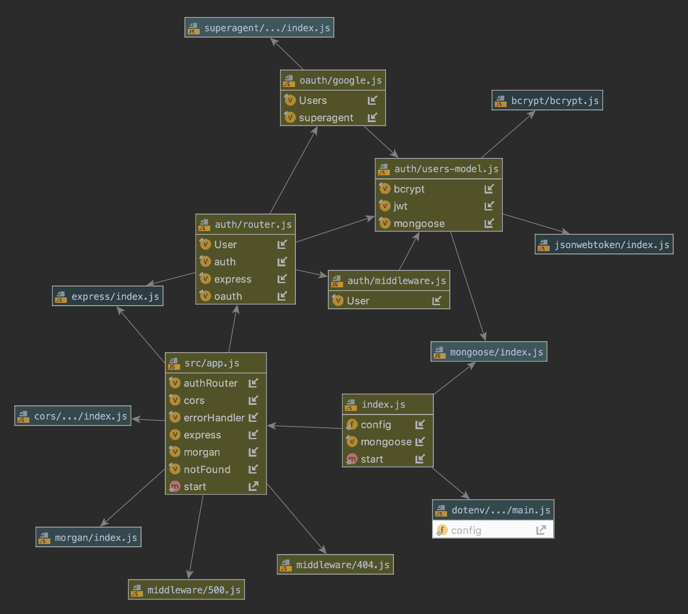

# LAB - 13

## Bearer Authorization

### Author: Austin Hedeen

### Links and Resources
* [submission PR](https://github.com/austinhedeen-401-advanced-javascript/lab-13/pull/1)
* [travis](https://travis-ci.com/austinhedeen-401-advanced-javascript/lab-13)
* [back-end](https://thawing-savannah-05679.herokuapp.com/)

#### Documentation
* [jsdoc](https://thawing-savannah-05679.herokuapp.com/docs/)

### Modules
#### `app.js`
##### Exported Values and Methods

###### `server`
The Express application (for testing)

###### `start(port)`
Starts the Express server on `port`

### Setup
#### `.env` requirements
* `PORT` - Port Number
* `MONGODB_URI` - URL to the running mongo instance/db

#### Running the app
* `npm start`
* Endpoint: `/docs`
  * Renders Developer Documentation

#### Tests
* `npm test`

#### UML

